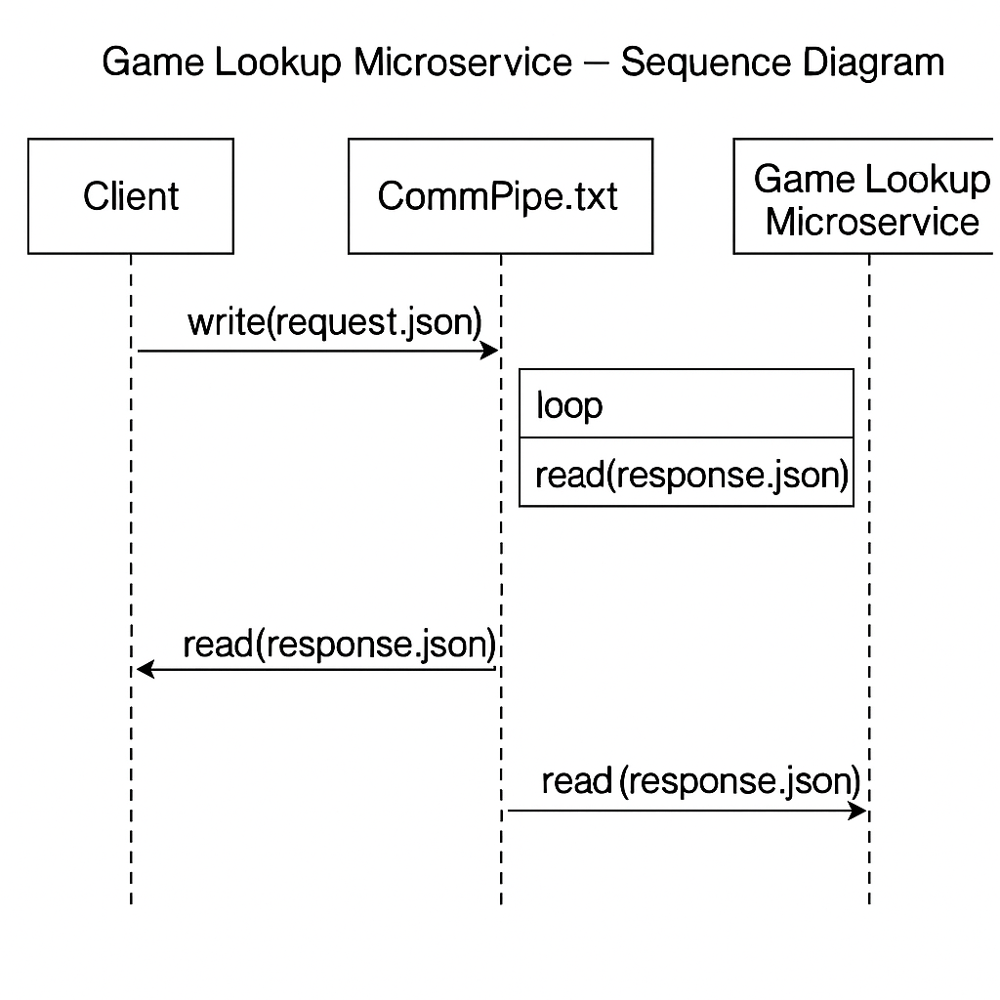

#  Game Lookup Microservice – Microservice A

This microservice allows a main program to look up video game information (genre, platform, year) by providing the game title. It reads a request from a JSON file and returns a response in another JSON file.

---

## How to Request Data

To request game data, create a file named `request.json` in the same folder. Example:

```json
{
  "title": "Halo 3"
}

Then, run the microservice using:

python3 game_service.py

---

## How to Receive Data

If the game is found, the response will look like this in `response.json`:

```json
{
  "title": "Halo 3",
  "genre": "Shooter",
  "platform": "Xbox 360",
  "year": 2007
}

If the game is not found, the response will be:
{
  "error": "Game not found. Please try another title."
}

---

## Communication Pipe

- Input: `request.json`  
- Output: `response.json`  
- Format: JSON-formatted text files  
- Communication style: file-based (not HTTP or socket)

---

## UML Sequence Diagram


This diagram shows how the client communicates with the game lookup microservice using JSON files as a communication pipe:



## Sample Integration Code (for your teammate)

```python
import json
import os

# Step 1: Write request
with open("request.json", "w") as f:
    json.dump({"title": "Minecraft"}, f)

# Step 2: Call the microservice
os.system("python3 game_service.py")

# Step 3: Read and display the response
with open("response.json", "r") as f:
    response = json.load(f)
    print(response)


